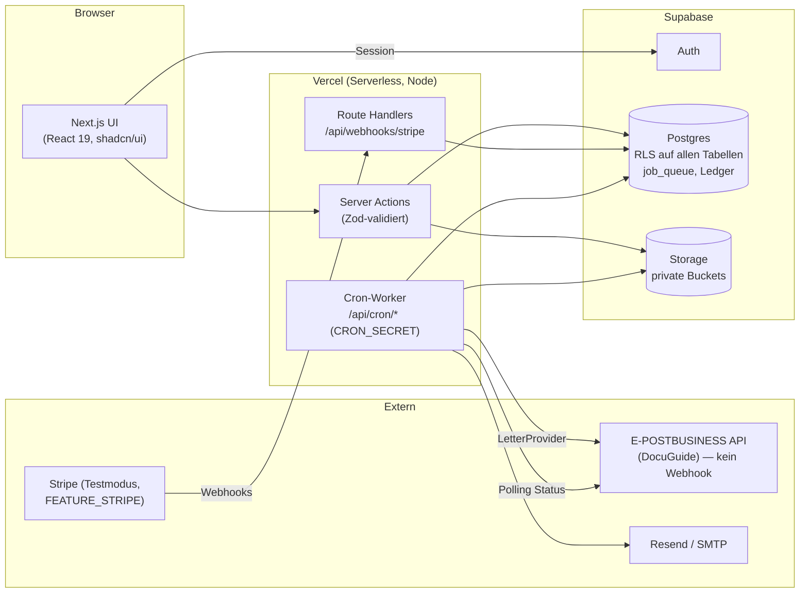
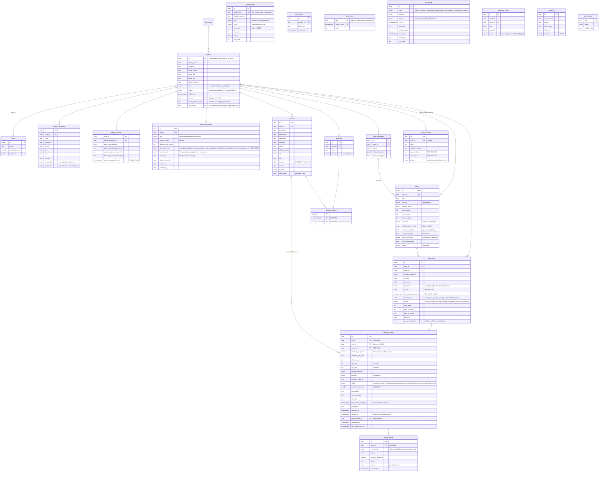

# ARCHITECTURE — E-Post-Mailer

> Systemarchitektur. Grundsatzentscheidungen als ADRs in `docs/adr/` (dort jeweils Begründung + Alternativen).
> **Stand: final (Phase 10).** Betriebsmodell entschieden: Eigenversender (ADR-0008).

## 1. Systemüberblick



- **Alle Mutationen serverseitig** (Server Actions / Route Handlers) mit Zod; der Browser spricht Supabase nur für Auth-Session und lesende, RLS-geschützte Queries an.
- **Hintergrundarbeit** ausschließlich über die DB-Queue + Vercel Cron (ADR-0004). E-Post liefert keine Webhooks → gedrosseltes Status-Polling.
- **Versand-Provider** hinter `LetterProvider`-Interface; `MockProvider` bei `MOCK_MODE=true` oder fehlender Konfiguration (ADR-0005).

## 2. ER-Diagramm



(`pricing_table`, `job_queue`, `webhook_events`, `audit_log`, `app_settings`, `epost_*` sind bewusst beziehungsarm — Zugriff nur service-role, siehe ADR-0002 §4.)

## 3. Versand-Pipeline (Happy Path + Fehlerfall)

```mermaid
sequenceDiagram
    participant U as Nutzer
    participant SA as Server Action
    participant DB as Postgres
    participant W as Cron-Worker
    participant P as LetterProvider

    U->>SA: Versand bestätigen (Wizard, client_token)
    Note over SA,DB: client_token unique je User —<br/>Doppelklick/Retry liefert bestehenden Job
    SA->>DB: TRANSAKTION: book_credit(spend, job_confirm, Jobsumme)<br/>+ send_job + items (Preis-Snapshots)<br/>+ submit_item-Queue-Jobs
    Note over SA,DB: insufficient_funds → Abbruch,<br/>nichts angelegt
    SA-->>U: Job angelegt (queued)

    loop jede Minute (Batch ≤ 10, Zeitbudget)
        W->>DB: claim_jobs(FOR UPDATE SKIP LOCKED)
        W->>W: PDF personalisieren + validieren
        alt Blattzahl weicht von Schätzung ab
            W->>DB: book_credit(item_render_adjust) — Refund bei weniger,<br/>Nachbelastung bei mehr Blättern
            Note over W,DB: Nachbelastung nicht gedeckt →<br/>Item on_hold_funds, KEIN Versand,<br/>Mail an Nutzer; Wiederaufnahme nach Aufladung
        end
        W->>P: submitLetter(item, DuplicateFailsafe, custom1=item.id)
        P-->>W: letterID
        W->>DB: item → submitted, status_event
        Note over W,P: Crash nach POST: Recovery nur via<br/>Provider-Lookup (custom1/batch),<br/>nie blinder Resubmit (ADR-0004 §5)
    end

    loop alle 15 min (gedrosselt)
        W->>P: Status offener Sendungen (1–3)
        P-->>W: statusID 1|2|3|4|99
        W->>DB: Status + Zeitleiste aktualisieren
        alt statusID 99 (final)
            W->>DB: book_credit(refund, item_failed, tatsächlich belasteter VK)
            Note over W,DB: eigener reference_type — kollidiert nie<br/>mit item_render_adjust desselben Items
            W->>DB: send_email-Job (Fehlerbenachrichtigung)
        end
    end
```

- **Probeversand:** identischer Pfad mit `is_test=true` — keine Spend-Buchung, `testFlag` beim Provider, Ergebnis-PDF (`TestResult`, 48 h) im Wizard abrufbar.
- **Stornofrist:** `scheduled_release_at` gesetzt → Einlieferung in den Sammelkorb (UploadManagement); `release_queued`-Job zum Zeitpunkt X; bis dahin Stornieren (cancelQueued + Refund) oder Vorziehen möglich.
- **Retry:** transienter Fehler → Backoff (ADR-0004); endgültig → `failed` + Refund; E324-Duplikat → als bereits eingeliefert behandeln, Status nachziehen.

## 4. Storage-Layout (alle Buckets privat, signierte URLs)

| Bucket | Pfad | Inhalt | Lebensdauer |
|---|---|---|---|
| `letters` | `{user_id}/letters/{letter_id}.pdf` | Upload-Original / Editor-Vorschau | bis Löschung durch Nutzer |
| `letters` | `{user_id}/jobs/{job_id}/{item_id}.pdf` | personalisierte Versand-PDFs | `LETTER_RETENTION_DAYS` nach Zustellung (Cron) |
| `assets` | `{user_id}/logos/{uuid}.{ext}` | Briefkopf-Logos | bis Löschung |
| `imports` | `{user_id}/{uuid}.csv/.xlsx` | Import-Rohdateien | 24 h (Cron) |

## 5. Sicherheits-Grundsätze (Details ADR-0002, -0003, -0005)

- RLS überall; Admin doppelt abgesichert (RLS + Server-Guard); geschützte Profilspalten per Trigger.
- Geld nur über `book_credit` (SECURITY DEFINER, service-role); Ledger append-only; Idempotenz über disjunktes `reference_type`-Vokabular (ADR-0003 §3); Wizard-Bestätigung idempotent via `client_token`.
- EK-Preise/Marge nie im Client; Kostenvorschau liefert ausschließlich VK.
- E-Post-Credentials + Tokens AES-256-GCM-verschlüsselt; Adress-/Briefdaten nie im Klartext in Logs.
- Worker-Endpoints nur mit `CRON_SECRET`; Stripe nur mit Signaturprüfung + `webhook_events`-Idempotenz.
- **Rate Limiting** Postgres-basiert (`rate_limits`-Tabelle, Fixed Window) auf Auth-, Upload- und Versand-Endpunkten — Serverless-tauglich ohne Fremd-Service (ADR-0002).
- **DSGVO-Lebenszyklus** (Löschung/Anonymisierung/Retention) vollständig definiert in ADR-0009 inkl. FK-`ON DELETE`-Matrix.

## 6. Datenbank-Funktionen (alle SECURITY DEFINER, `search_path` gepinnt, nur `service_role`)

| Funktion | Zweck |
|---|---|
| `book_credit` | **Einziger Geld-Eintrittspunkt.** Row-Lock je Nutzer, kein Negativsaldo, append-only Ledger |
| `confirm_send_job` | Job + Belastung + Items + Queue-Jobs in **einer** Transaktion; `client_token`-Idempotenz |
| `cancel_pending_job_items` | Storno noch nicht eingelieferter Items inkl. Erstattung |
| `admin_retry_item` | Retry: Claim (exakt einmal) + Klon + Belastung + Queue, atomar |
| `anonymize_account` | DSGVO-Löschung: Erstattung, PII-Hard-Delete, Snapshot-Scrub, Profil-Anonymisierung |
| `claim_jobs` / `reset_stuck_jobs` | Queue-Claim mit `FOR UPDATE SKIP LOCKED`; Lock-Recovery |
| `check_rate_limit` | Fixed-Window-Drosselung (Postgres statt Fremd-Service) |
| `check_ledger_integrity` | Abgleich `SUM(ledger)` vs. denormalisierter Saldo |
| `admin_dashboard_stats` | KPI-Aggregation in SQL |
| `set_default_sender_address` / `upsert_sender_address` | „genau eine Standardadresse" atomar |
| `is_admin` / `is_service_request` | RLS- und Trigger-Helfer |

## 7. Spaltenschutz für Einkaufspreise

`ek_cents`, `total_ek_cents` und `pricing_snapshot` sind **nicht** durch RLS zu schützen (RLS filtert
Zeilen, keine Spalten). Migration `…0003_ek_column_privacy.sql` entzieht der Rolle `authenticated`
daher das Tabellen-`SELECT` und erteilt eine **explizite Spaltenliste ohne die EK-Felder**. Neue
Spalten sind dadurch standardmäßig gesperrt und müssen bewusst freigegeben werden (siehe
`retried_at`/`retry_of_item_id` in `…0004`).

## 8. Erledigte Verifikationsgates

- ✅ Swagger v2.6.1 geladen; Sammel-Statusabfrage (`Letter/Open`), Crash-Lookup (`Letter/Custom1`),
  `CancelQueued`/`ReleaseQueued`, `Letter/Registered`, `costCenter`-Limit (8 Zeichen) bestätigt.
- ✅ `addressLine1–5` tragen **keine** PLZ/Ort/Land (ASSUMPTIONS A-010).
- ✅ CSP-Nonce gegen den Produktions-Build per HTTP verifiziert.
- ⬜ Offen bis zur ersten Live-Umgebung: DB-abhängige QA-Punkte (`docs/QA_CHECKLIST.md`) und der
  E-Post-Live-Testplan (`docs/EPOST_INTEGRATION.md` §4).
- International (Zonen/Preise) strukturell vorbereitet, initial deaktiviert.
